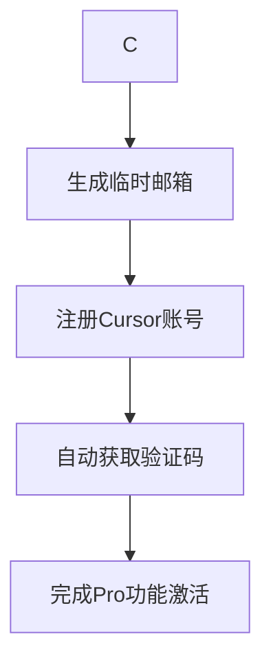

# Cursor-TempMail-Helper 🔄📧
_通过临时邮箱实现Cursor Pro功能无限试用的自动化工具_

[](LICENSE)
[](https://github.com/VkRainB/Cursor-TempMail-Helper/releases)

## ✨ 功能特性
1. **一键生成临时邮箱**  

2. **自动化验证码捕获**  
   - 实时监听邮箱收件箱
   - 自动解析Cursor验证邮件内容

## 🛠️ 安装说明
### 环境要求
- Windows 10+ 

### 快速开始
下载

## 🚀 使用指南
### 基础工作流



## 🔍 实现原理
### 技术架构
```text
+-----------------+       +-----------------+       +-----------------+
| 临时邮箱生成模块 | ----> | 验证码捕获模块  | ----> | Cursor API交互层 |
+-----------------+       +-----------------+       +-----------------+
        ↓                         ↓                          ↓
  基于临时邮箱的          IMAP协议实时监听                  手动操作
无限邮箱机制              正则表达式解析验证码       
```

### 合规声明
本工具仅用于学习研究目的，建议使用者：
1. 遵守Cursor官方服务条款
2. 单个设备每日注册不超过3次

